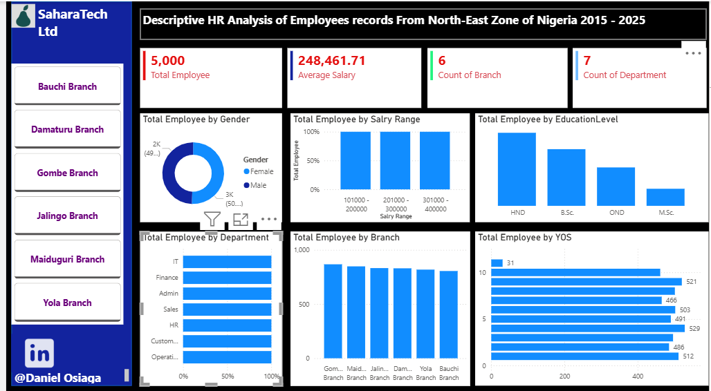

# Data-Analytics-Portfolio
## About
Daniel Osiaga is a passionate and results-driven researcher with a strong background in finance and data analytics, specializing in data-driven insights and quantitative analysis.

## Skills
Data Visualization - Power Bi, Python and Excel

I build dashboards and reporting visuals that helps businesses make quick and productive decisions. [Click Here](https://www.linkedin.com/posts/daniel-osiaga-41411672_making-sense-of-data-activity-7397591780759662592-bqWp?utm_source=share&utm_medium=member_desktop&rcm=ACoAAA9Sp9ABUvNv6A6_Xk7rClAkKG-oQ7z3bYY)
Researcher
Fianance and Data Alystics Training

## Project
Hospital REcord Management Analysis
Laptop Sales Performance Analysis
