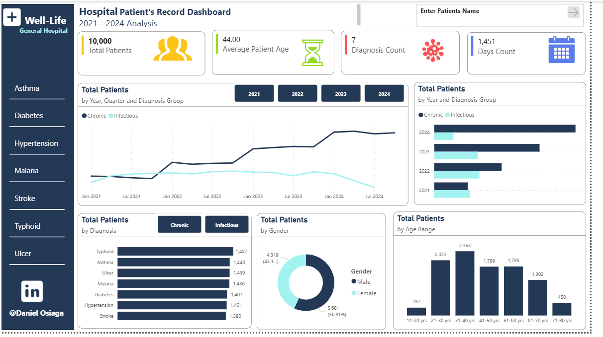

# Data-Analytics-Portfolio
## About
Daniel Osiaga is a passionate and results-driven researcher with a strong background in finance and data analytics, specializing in data-driven insights and quantitative analysis.

## Skills
Data Visualization - Power Bi, Python and Excel

I build dashboards and reporting visuals that helps businesses make quick and productive decision. [Click Here](Screenshot 2025-12-04 142907.png)
Researcher
Fianance and Data Alystics Training

## Project
Hospital REcord Management Analysis
Laptop Sales Performance Analysis
